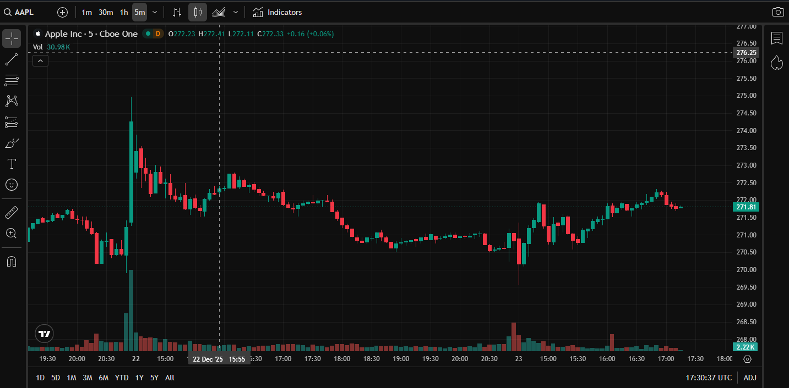

# Advanced Market Chart – TradingView Integration Demo

This repository demonstrates a **web-based advanced financial chart**
integrated using TradingView's charting technology.

## 🔍 Purpose
The purpose of this project is to evaluate and demonstrate:
- Advanced chart rendering
- Candlestick visualization
- Market data presentation
- Web-based chart integration capabilities

This implementation is intended **for evaluation and integration review only**.

## 🧩 Features
- Interactive candlestick chart
- Symbol switching support
- Date range selection
- Dark theme optimized for trading
- Responsive web layout

## 🌐 Live Demo
👉 [https://YOUR_USERNAME.github.io/REPO_NAME/](https://insane5055-dot.github.io/tradingview-advanced-chart-demo/)

## 🛠 Technology Stack
- HTML5
- CSS3
- JavaScript
- TradingView Advanced Chart Widget

## 📌 Roadmap
- Custom indicators integration
- Multiple market support (Equities / Indices)
- Option chain & derivatives visualization
- Backend market data connection (planned)

## ⚠️ Disclaimer
This project is a **technical demonstration** and is **not intended for commercial redistribution**.

---
© 2025 | Chart Integration Demo
